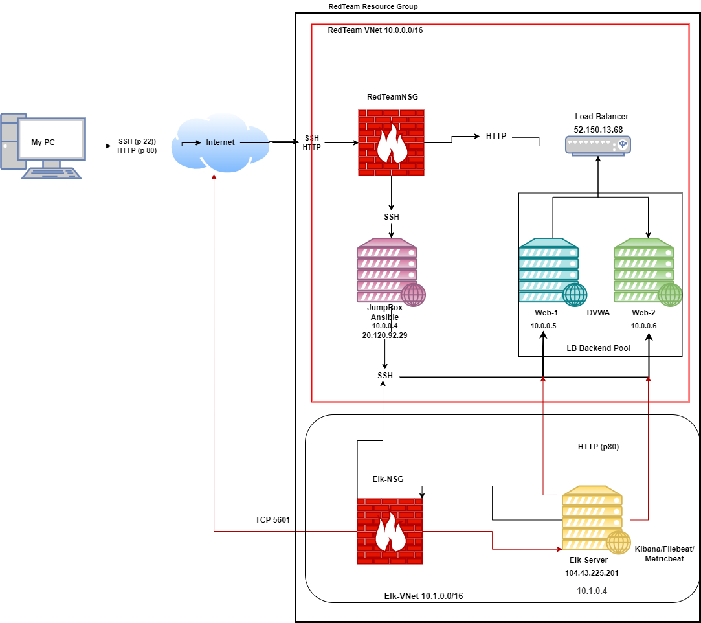

## Automated ELK Stack Deployment

The files in this repository were used to configure the network depicted below.



These files have been tested and used to generate a live ELK deployment on Azure. They can be used to either recreate the entire deployment pictured above. Alternatively, select portions of the YML file may be used to install only certain pieces of it, such as Filebeat.

<p>
<details>
  <summary>DVWA Installation Playbook</summary>
  
  
 <pre><code>---
- name: Config Web VM with Docker
  hosts: webservers
  become: true
  tasks:
  - name: docker.io
    apt:
      force_apt_get: yes
      update_cache: yes
      name: docker.io
      state: present

  - name: Install pip3
    apt:
      force_apt_get: yes
      name: python3-pip
      state: present

  - name: Install Docker python module
    pip:
      name: docker
      state: present

  - name: download and launch a docker web container
    docker_container:
      name: dvwa
      image: cyberxsecurity/dvwa
      state: started
      restart_policy: always
      published_ports: 80:80

   - name: Enable docker service
     systemd:
       name: docker
       enabled: yes</code></pre>
  
   </details>
  </p>
  
 <p>
<details>
  <summary>ELK Playbook</summary>
  
  <pre><code>---
- name: Configure Elk VM with Docker
  hosts: elk
  remote_user: azadmin
  become: true
  tasks:
    - name: Install docker.io
      apt:
        update_cache: yes
        name: docker.io
        state: present

    - name: Install pip3
      apt:
        force_apt_get: yes
        name: python3-pip
        state: present

    - name: Install Docker python module
      pip:
        name: docker
        state: present

    - name: Use more memory
      sysctl:
        name: vm.max_map_count
        value: "262144"
        state: present
        reload: yes

    - name: download and launch a docker elk container
      docker_container:
        name: elk
        image: sebp/elk:761
        state: started
        restart_policy: always
        published_ports:
          - 5601:5601
          - 9200:9200
          - 5044:5044

    - name: Enable service docker on boot
      systemd:
        name: docker
        enabled: yes</code></pre>
 </details>
  </p>

<p>
<details>
    <summary>Filebeat Playbook</summary>
  
<pre><code>---
- name: Installing and Launch Filebeat
  hosts: webservers
  become: yes
  tasks:
 - name: Download filebeat .deb
    command: curl -L -O https://artifacts.elastic.co/downloads/beats/filebeat/filebeat-7.4.0-amd64.deb

  - name: Install .deb file
    command: dpkg -i filebeat-7.4.0-amd64.deb

  - name: Copy
    copy:
      src: /etc/ansible/filebeat-config.yml
      dest: /etc/filebeat/filebeat.yml

  - name: Enable System Module
    command: filebeat modules enable system

  - name: Setup
    command: filebeat setup

 - name: Start service
    command: service filebeat start

  - name: Enable service on boot
    systemd:
      name: filebeat
      enabled: yes</code></pre>          
  </details>
  </p>
  
  <p>
<details>
    <summary>Metricbeat Playbook</summary>
  
 <pre><code>---
- name: Install Metricbeat
  hosts: webservers
  become: true
  tasks:

  - name: Download Metricbeat file
    command: curl -L -O https://artifacts.elastic.co/downloads/beats/metricbeat/metricbeat-7.6.1-amd64.deb

  - name: Install .deb File
    command: sudo dpkg -i metricbeat-7.6.1-amd64.deb

  - name: Copy to Web VMs
    copy:
      src: /etc/ansible/Metricbeat-config.yml
      dest: /etc/metricbeat/metricbeat.yml

  - name: Enable and configure
    command: metricbeat modules enable docker

  - name: Setup
    command: metricbeat setup -e

 - name: Start
    command: service metricbeat start

  - name: Enable Metric on Boot
    systemd:
      name: metricbeat
      enabled: yes</code></pre>
  </details>
  </p>
  
  This document contains the following details:
- Description of the Topology
- Access Policies
- ELK Configuration
  - Beats in Use
  - Machines Being Monitored
- How to Use the Ansible Build


### Description of the Topology

The main purpose of this network is to expose a load-balanced and monitored instance of DVWA, the D*mn Vulnerable Web Application.
Load balancing ensures that the application will be highly available, in addition to restricting inbound traffic to the network.

What aspect of security do load balancers protect? 

Load Balancers protect the availability of a network. 

What is the advantage of a jump box?

It prevents VMs from being exposed via a public IP Address.

Integrating an ELK server allows users to easily monitor the vulnerable VMs for changes to the logs and system metrics.

What does Filebeat watch for?

Filebeat monitors the log files or locations that you specify for changes.

What does Metricbeat record?

Metricbeat takes the metrics and statistics and ships them to the output that you specify, such as Elasticsearch or Logstash.

The configuration details of each machine may be found below.

| Name     | Function | IP Address | Operating System |
|----------|----------|------------|------------------|
| Jump Box | Gateway  | 20.120.92.29/10.0.0.4   | Linux            |
| Web-1    | Server    | 10.0.0.5  | Linux            |
| Web-2    | Server    | 10.0.0.6  | Linux            |
| Elk-Server |Monitor | 104.43.225.201/10.1.0.4 | Linux            |
| Load Balancer | Load Balancing  | 52.150.13.68   | Linux    |
| UserPC | Control  |  71.113.149.233  | Windows 10           |

### Access Policies

The machines on the internal network are not exposed to the public Internet. 

Only the  machine can accept connections from the Internet. Access to this machine is only allowed from the following IP addresses:
71.113.149.233

Machines within the network can only be accessed by the Jump Box.
Which machine did you allow to access your ELK VM? What was its IP address?
Jump Box (10.0.0.4) ssh, User PC (71.113.149.233) port 5601

A summary of the access policies in place can be found in the table below.

| Name     | Publicly Accessible | Allowed IP Addresses |
|----------|---------------------|----------------------|
| Jump Box | Yes                   | 71.113.149.233 ssh port 22   |
| Web-1    | No                    | 10.0.0.4 ssh port 22                     |
| Web-2    | No                    | 10.0.0.4 ssh port 22                     |
| Load Balancer  | No              | 71.113.149.233 HTTP port 80                     |
| Elk Server | No                  |  71.113.149.233 port 5601                    |

### Elk Configuration

Ansible was used to automate configuration of the ELK machine. No configuration was performed manually, which is advantageous because...
What is the main advantage of automating configuration with Ansible?

Provisions can be easily made.

The playbook implements the following tasks:

- _Hosts and user specifications:_

```
- name: Configure Elk VM with Docker
  hosts: elk
  remote_user: azadmin
  become: true
  tasks:
```

- _Install packages:
	- _Docker.io_
	- _Python3-pip_
	- _Docker elk container_

- _Increase system memory:_
```
- name: Use more memory
      sysctl:
        name: vm.max_map_count
        value: "262144"
        state: present
        reload: yes
```
- _Launch docker container with these ports:_
	- _5601:5601_
	- _9200:9200_
	- _5044:5044_

The following screenshot displays the result of running `docker ps` after successfully configuring the ELK instance.

_Elk Server_


_Web-1_


_Web-2_


### Target Machines & Beats
This ELK server is configured to monitor the following machines:

- _Web-1: 10.0.0.5_
- _Web-2: 10.0.0.6_

We have installed the following Beats on these machines:

-_Filebeat_
-_Metricbeat_

These Beats allow us to collect the following information from each machine:
- _TODO: In 1-2 sentences, explain what kind of data each beat collects, and provide 1 example of what you expect to see. E.g., `Winlogbeat` collects Windows logs, which we use to track user logon events, etc._

### Using the Playbook
In order to use the playbook, you will need to have an Ansible control node already configured. Assuming you have such a control node provisioned: 

SSH into the control node and follow the steps below:
- Copy the _____ file to _____.
- Update the _____ file to include...
- Run the playbook, and navigate to ____ to check that the installation worked as expected.

_TODO: Answer the following questions to fill in the blanks:_
- _Which file is the playbook? Where do you copy it?_
- _Which file do you update to make Ansible run the playbook on a specific machine? How do I specify which machine to install the ELK server on versus which to install Filebeat on?_
- _Which URL do you navigate to in order to check that the ELK server is running?

_As a **Bonus**, provide the specific commands the user will need to run to download the playbook, update the files, etc._
